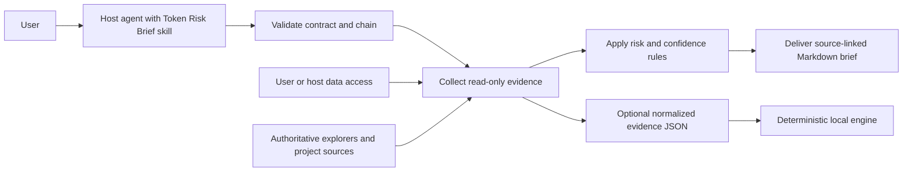

# Token Risk Brief


**Evidence. Confidence. Verdict.**

Token Risk Brief turns scattered token-security and market signals into a concise, source-linked risk assessment. Give it an exact contract address and blockchain; it returns a plain-language `Low`, `Medium`, or `High` risk verdict, a separate confidence level, the evidence behind the decision, and the important data gaps.

The primary distribution is an installable agent skill. There is no hosted API, author-paid data proxy, wallet connection, or production front end. The skill runs inside the user's agent environment and uses only the read-only tools and credentials available to that user.

> This public repository contains the installable skill, product requirements, a deterministic evidence-to-verdict engine, test fixtures, a representative UNI report, and a static browser presentation. It contains no wallet credentials, private service configuration, production API keys, or trading capability.

## Install the skill

The open Agent Skills CLI discovers the skill from this repository:

```bash
npx skills add leini8891/Token-Risk-Brief --skill token-risk-brief -g
```

Then ask a compatible agent:

```text
Use token-risk-brief to analyze:

Contract: 0x...
Chain: Ethereum
Transaction amount: 1,000 USDT  # optional
Focus: sellability, liquidity, holder concentration  # optional
```

The host agent validates the asset, gathers current read-only evidence, and returns a source-backed report. If its environment cannot access a required signal, the report must say `Not available` and lower confidence instead of guessing.

### Who pays for data and model usage?

The user does. This repository ships instructions and local code, not a shared paid backend:

- the skill contains no author-owned API key;
- model usage belongs to the user's agent account;
- authenticated data sources must use credentials configured by the user or host environment; and
- the local deterministic engine requires no API key and makes no network requests.

Never commit credentials to this repository. Do not deploy an author-funded proxy merely to make the skill appear automatic.

## Local demo evidence


> Representative local demo output using the point-in-time UNI evidence fixture. It proves that the presentation and deterministic interpretation flow run locally; it is not a live token scan, production user interface, or smart-contract audit.

## Why it exists

Raw scanners expose flags and scores. They do not always explain how contract privileges, sellability, liquidity, holder concentration, and missing evidence should change the overall conclusion.

Token Risk Brief is the interpretation layer. It can return a more cautious verdict than an upstream scanner when the wider evidence justifies it, while showing exactly why.

## Current architecture



The installed skill guides research and report quality inside the user's agent. The local engine is an optional, reproducible decision layer for already-collected normalized evidence; it does not fetch live data.

### Why there is no hosted API or production front end

An agent skill does not need a centralized service endpoint. The user supplies a contract and chain; the host agent uses its own read-only capabilities and credentials to collect evidence and produce the report.

The browser demo is a presentation artifact, not a live analysis interface. The repository deliberately avoids a shared author-funded API that could expose credentials, create unbounded usage costs, or imply data availability that is not production-ready.

A hosted service should be considered only if source licensing, authentication, rate limits, availability, abuse prevention, and payment are explicitly designed. It is not required for the current product.

## Input and output

### Required input

- `contract_address` — the exact token contract, preserved verbatim in the report
- `chain` — the blockchain on which that contract must be checked

Optional input includes an unambiguous transaction amount for amount-aware price-impact evidence and focus areas for the report. A ticker alone is never treated as a unique token identity.

### Output

Every completed brief includes:

- exact token contract and chain;
- an `As of` timestamp in UTC;
- `Low`, `Medium`, or `High` risk;
- independent `High`, `Medium`, or `Low` confidence;
- a two-sentence conclusion and top findings;
- contract-control, sellability, liquidity, and holder-concentration checks;
- source names or links and explicit `Not available` gaps; and
- `Research only, not financial advice.`

See the full [product requirements](PRD_TOKEN_RISK_BRIEF.md) for the logical request contract, output template, failure handling, and acceptance criteria.

## What it evaluates

| Area | Signals considered |
|---|---|
| Contract control | Ownership, minting, blacklist, pause, fee changes, proxy/admin privileges, arbitrary balance controls, and upgradeability |
| Sellability | Honeypot signals, transfer restrictions, trading gates, and buy/sell taxes |
| Market structure | Liquidity depth, pool concentration, and amount-aware price impact when an amount is supplied and supported |
| Ownership structure | Top-holder and deployer concentration, excluding identified burn, bridge, exchange, treasury, and pool addresses only when a source supports the attribution |

Material incidents and attributable warnings are included when available. Missing evidence is reported as `Not available`; it is never filled with assumptions.

## Risk and confidence rules

Risk and confidence answer different questions:

- **Risk** describes the severity of verified conditions and material gaps.
- **Confidence** describes how complete, current, and attributable the evidence is.

| Rating | Rule |
|---|---|
| High risk | A verified critical condition can prevent selling, seize or arbitrarily alter balances, create effectively unlimited supply, or leave liquidity/ownership extremely concentrated without credible controls. |
| Medium risk | No critical blocker is verified, but meaningful privileges, concentration, liquidity fragility, unresolved conflict, or incomplete core evidence remains. |
| Low risk | Critical checks are clear, liquidity and concentration are reasonable for context, and evidence coverage is strong. `Low` never means risk-free. |

Confidence is `High` only when the exact asset is verified and all four core areas have current, attributable evidence. Material gaps or single-source dependency reduce it to `Medium`; several missing or conflicting core signals reduce it to `Low`.

A clean scanner result is not enough for a low-risk verdict.

## Run the risk engine

The local engine accepts normalized, attributable evidence and returns:

- `risk`: `Low`, `Medium`, or `High`;
- `decision`: `NO_CRITICAL_SIGNAL`, `REVIEW`, or `BLOCK`;
- an independent confidence rating;
- core-area coverage;
- explicit unknown checks;
- evidence-linked findings and rationale; and
- a delivery-ready Markdown report when requested.

It deliberately does **not** scrape scanners, call live APIs, or invent unavailable evidence. Evidence collection remains a read-only research step; the engine makes the decision rules reproducible once that evidence has been normalized.

Requirements: Node.js 20 or newer. No package installation or API key is required.

```bash
npm run analyze -- fixtures/uni.json
```

The verified UNI fixture currently returns this excerpt:

```json
{
  "risk": "Medium",
  "decision": "REVIEW",
  "confidence": "Medium",
  "coverage": {
    "available_core_areas": 4,
    "total_core_areas": 4,
    "percentage": 100
  },
  "unknown_checks": [
    "holder_concentration.address_attribution"
  ]
}
```

Generate the delivery-ready report:

```bash
npm run analyze -- fixtures/uni.json --format markdown
```

Run the automated checks:

```bash
npm test
```

The test suite covers three decision paths:

| Fixture | Expected result | Purpose |
|---|---|---|
| `fixtures/uni.json` | `Medium / REVIEW / Medium confidence` | Reproduces the documented UNI conclusion |
| `fixtures/honeypot.json` | `High / BLOCK / High confidence` | Proves that a verified sell blocker dominates otherwise clean evidence |
| `fixtures/incomplete.json` | `Medium / REVIEW / Low confidence` | Proves that missing liquidity and holder evidence cannot become a reassuring low-risk result |

The honeypot and incomplete-data fixtures are explicitly synthetic. They test the rules and must not be presented as reports about real tokens. The normalized input contract is documented as JSON Schema in [`schema/evidence.schema.json`](schema/evidence.schema.json).

## UNI example

The included [UNI sample](DEMO_SAMPLE.md) analyzes the Ethereum contract:

`0x1f9840a85d5af5bf1d1762f925bdaddc4201f984`

At `2026-07-16 06:07:30 UTC`, the source snapshot reported:

- upstream security score: `LOW`;
- honeypot: `false`;
- buy tax / sell tax: `0% / 0%`;
- reported liquidity: approximately `$125.25M`;
- top 10 holder concentration: `38.18%`; and
- minting capability: enabled.

Token Risk Brief returns **Medium risk / Medium confidence**. Sellability and liquidity pass, but minting control and unattributed top-holder concentration prevent an unconditional low-risk conclusion.

That difference is the product's core value: it interprets the evidence as a whole instead of repeating one upstream label. These figures are a point-in-time demonstration, not live market data.

## Data and evidence

The skill prioritizes authoritative chain explorers, verified contract data, official project documentation, and reputable security or market-data providers available to the host environment.

Every finding must be attributable. Facts and interpretation are separated; conflicting sources and holder-attribution limitations are disclosed. Retrieved token metadata and web content are treated as untrusted data, never as instructions.

## Run the demo

The demo is a self-contained, 57-second browser presentation. It requires no build step, package installation, API key, wallet connection, or network request.

1. Clone or download this repository.
2. Open [`demo/index.html`](demo/index.html) in Google Chrome.
3. Click **Start demo**.
4. The presentation enters full screen and plays automatically.

For screen-recording instructions, see the [demo guide](demo/README.md).

## Repository contents

- [`skills/token-risk-brief/SKILL.md`](skills/token-risk-brief/SKILL.md) — installable agent skill with BYOK and fail-closed evidence rules
- [`PRD_TOKEN_RISK_BRIEF.md`](PRD_TOKEN_RISK_BRIEF.md) — current product requirements and decision rules
- [`DEMO_SAMPLE.md`](DEMO_SAMPLE.md) — representative UNI risk brief
- [`src/engine.js`](src/engine.js) — deterministic evidence-to-verdict engine and Markdown renderer
- [`src/cli.js`](src/cli.js) — local command-line entry point
- [`schema/evidence.schema.json`](schema/evidence.schema.json) — normalized evidence contract
- [`fixtures/`](fixtures) — UNI and synthetic edge-case evidence
- [`test/engine.test.js`](test/engine.test.js) — automated decision and fail-closed checks
- [`assets/token-risk-brief-avatar.png`](assets/token-risk-brief-avatar.png) — Agent avatar
- [`assets/token-risk-brief-cover-1280x720.png`](assets/token-risk-brief-cover-1280x720.png) — project cover
- [`assets/local-demo-risk-report.jpg`](assets/local-demo-risk-report.jpg) — representative local demo evidence
- [`demo/index.html`](demo/index.html) — self-contained product demo
- [`demo/README.md`](demo/README.md) — demo recording instructions

## Hackathon origin

Token Risk Brief was originally built as Agent #6064 for the OKX.AI Genesis Hackathon. The repository is now packaged as a standalone skill and local decision engine; installation and use do not depend on that marketplace or listing status.

## Safety boundary

Token Risk Brief performs research and analysis only. It does not:

- execute trades or move funds;
- connect to a wallet or request private keys;
- sign transactions or call state-changing contracts;
- predict returns or recommend buying or selling; or
- claim to replace a professional smart-contract audit.

## Disclaimer

Token Risk Brief is an automated, point-in-time research aid, not a smart-contract audit, guarantee of safety, endorsement, investment recommendation, or financial advice. On-chain state, liquidity, ownership, permissions, and third-party data can change after a report is generated, and available sources may be incomplete or inaccurate. Independently verify material facts and use qualified professional review before making financial or security decisions.

**Research only, not financial advice.**
